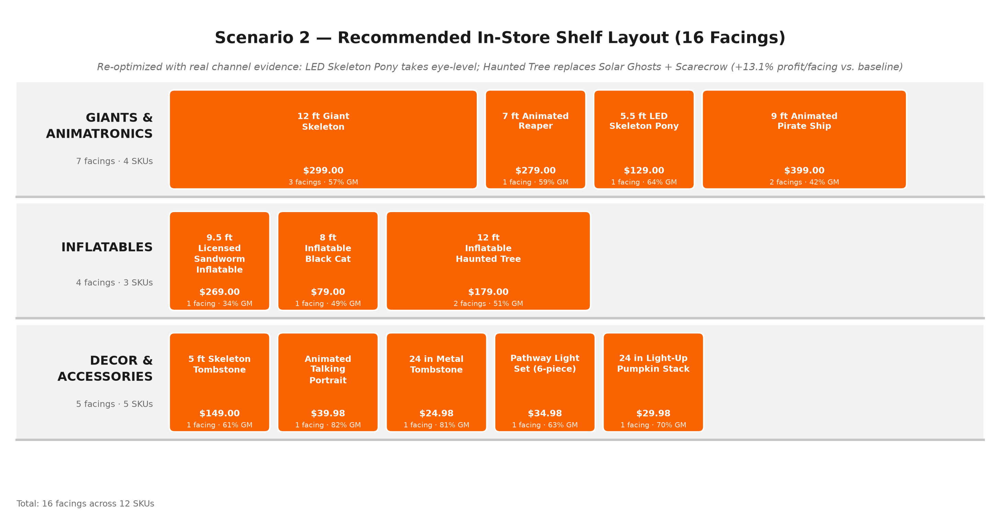

# Halloween Decor Assortment Simulation

A Python Monte Carlo simulation built for a Home Depot merchandising case study. The task: as the merchant for the Halloween Decor category, recommend next season's assortment — **exactly 16 in-store facings** plus **up to 4 online-only items**, covering Giants & Animatronics, Inflatables, and Decor & Accessories.

The simulation replaced an earlier Simio model. It reads last season's real performance data and supplier offers, simulates customers shopping different shelf configurations, and compares them on profit.



## My role

This was my entry in the Hometown AI Innovation Challenge, a Home Depot merchandising case competition. It finished **2nd place**.

I directed the build using Claude Code, Anthropic's AI coding tool. I supplied the case brief, the purchase-logic inputs (arrival and browse-time distributions, the impulse vs. goal-oriented customer mix, shelf-position and category multipliers), and the shelf configurations to compare. Claude Code wrote the Python, and I steered it through each round of changes: the sensitivity analysis, shelf-position optimization, stress test, and graphics.

What I did myself, beyond prompting:

- **Questioned the model rather than accepting its output.** I asked whether star ratings should count (tested: under a 1.3% effect, so left out of the base model) and whether in-store vs. online performance had actually been compared. It hadn't been done validly, and that is now documented as a limitation.
- **Caught gaps in the recommendation.** I noticed several supplier candidates had no recommendation at all, which led to testing them and to the Haunted Tree swap.
- **Cross-checked against my team's scenario workbook** and brought its channel evidence and downside case into the model. Where they still disagree (for example, Haunted Tree online vs. in-store), the conflict is recorded in [HANDOFF.md](HANDOFF.md) instead of being smoothed over.
- **Made the final calls** on which swaps to adopt and how results were presented.

The model's constants beyond the inputs I specified (the base-probability scale and the per-facing visibility bump) are modeling assumptions, not validated against real sales, and are listed under [Model in brief](#model-in-brief).

## What the simulation does

1. **Loads the case data** (a synthetic sample is bundled; the real workbook is withheld) — 16 current items (price, cost, margin, full-price sell-through, ratings, store vs. online units) and 10 new supplier candidates.
2. **Simulates 10,000 customer visits** per configuration. Each customer is an impulse or goal-oriented shopper with a random browse time, and decides independently whether to buy each item based on a purchase probability built from the item's sell-through, shelf position, facings, category, and historical channel mix.
3. **Compares three configurations** — last season's assortment (baseline), a high-margin-focused alternative, and the recommended "Scenario 2" — on revenue and gross margin per customer, conversion rate, and **profit per facing**.
4. **Optimizes shelf placement** with an exact dynamic-programming solver that assigns a fixed roster of items to eye / mid / waist / floor tiers to maximize expected profit.
5. **Stress-tests the answer** — impulse-buyer share from 10% to 70%, a 70%-demand downside case, and an optional star-rating adjustment.

## Headline results

Simulated over 10,000 customers, fixed seed:

| | Last season | Scenario 2 (recommended) | Change |
|---|---:|---:|---:|
| In-store gross margin | $979,735 | $1,107,942 | **+$128,207** |
| Profit per facing | $61,233 | $69,246 | **+13.1%** |
| Conversion rate | 64.4% | 66.4% | +2.0 pts |
| Combined in-store + online GM | $1,376,962 | $1,495,677 | +8.6% |

Scenario 2 beats the baseline at every impulse-buyer share tested and under the downside demand case. Adding star ratings to the model changed results by at most 1.2%, so ratings are not driving the recommendation.

**Recommended assortment** (16 facings, 12 in-store SKUs): 12 ft Giant Skeleton (3 facings), 7 ft Animated Reaper, 5.5 ft LED Skeleton Pony, 5 ft Skeleton Tombstone, 9 ft Animated Pirate Ship (2), 9.5 ft Licensed Sandworm Inflatable, Animated Talking Portrait, 24 in Metal Tombstone, Pathway Light Set, 8 ft Inflatable Black Cat, 24 in Light-Up Pumpkin Stack, 12 ft Inflatable Haunted Tree (2). **Online:** Life-Size Animated Butler, 16 ft Haunted Archway, Animated Witch Cauldron, 10.5 ft Licensed Character Inflatable. **Dropped:** LED Fog Machine, 12 ft Reaper Inflatable, Halloween Doormat Assortment.

One open question: the model places the Haunted Tree in-store, but it doesn't price in shipping or floor footprint, and one source recommends it online. See [HANDOFF.md](HANDOFF.md) for this and other open decisions.

## How to run

Requires Python 3.10+.

```bash
pip install -r requirements.txt
python halloween_simulation.py      # runs everything and rewrites the CSV outputs
python halloween_shelf_layout.py    # regenerates the 2D planogram
python halloween_shelf_layout_3d.py # regenerates the 3D render
```

Run from the repo root. By default the scripts read `sample_data.xlsx` (synthetic; see the data note below) and write outputs to the current directory. If you have the real case-study workbook, point the code at it:

```bash
# macOS/Linux
HALLOWEEN_DATA_FILE="path/to/real_workbook.xlsx" python halloween_simulation.py
# Windows PowerShell
$env:HALLOWEEN_DATA_FILE = "path\to\real_workbook.xlsx"; python halloween_simulation.py
```

If the workbook is open in Excel, the loader falls back to reading a temporary copy.

> Running the scripts overwrites the CSVs and graphics in the repo. The committed versions were generated from the real data, so a run on the sample data will replace them with illustrative numbers.

## Repository contents

| File | Purpose |
|---|---|
| `halloween_simulation.py` | Data loading, purchase model, three configurations, sensitivity analyses, position optimizer, stress test |
| `halloween_shelf_layout.py` | 2D planogram grouped by category; `build_layout()` accepts any item roster |
| `halloween_shelf_layout_3d.py` | Pseudo-3D shelf render |
| `halloween_decor_report.md` | Full write-up: recommendation, placement map, rationale, methodology, results, sensitivities |
| `halloween_gm_profit_summary.md` | Gross margin and profit for every in-store, online, and removed item |
| `halloween_simulation_*.csv` | Simulation outputs: results, per-item detail, sensitivity, stress test, eye-level ranking, full product data |
| `sample_data.xlsx` | Synthetic stand-in for the withheld source workbook (same layout, random values) |
| `make_sample_data.py` | Regenerates `sample_data.xlsx` |
| `HANDOFF.md` | Project state, model details, open decisions, environment notes |
| `Halloween_Decor_Assortment_Summary.docx/.pdf` | Earlier summary document, not regenerated from the current model |

## Model in brief

```
P(buy item) = base_prob × position × customer_type × category × facings × channel × attention
```

- `base_prob` comes from the item's full-price sell-through. New items have no history, so their sell-through is an **assumption**.
- Position multipliers (eye 1.5 / mid 1.2 / waist 0.8 / floor 0.4), the 30/70 impulse/goal-oriented mix, and category multipliers were specified inputs.
- `channel` uses last season's actual store/online unit split, only for items sold in both channels.
- The base-probability scale (0.15) and the +15%-per-extra-facing rule are modeling assumptions, and online results reuse the same 10,000 visits rather than calibrated online traffic.

Read the outputs as directionally reliable comparisons between assortments, not precise dollar forecasts. Full detail is in [halloween_decor_report.md](halloween_decor_report.md).

## Data note: real data is withheld

The real case-study workbook is Home Depot case-competition material and is **not included** in this repository. In its place, `sample_data.xlsx` is a small **synthetic** file with the same sheet layout, column headers, and item names, so the code runs end to end. Every price, cost, unit count, rating, and sell-through value in it is randomly generated (by `make_sample_data.py`) and means nothing.

- Results from the sample data are illustrative only and will not match the numbers in this README, the report, or the committed CSVs and graphics. Those were produced from the real workbook.
- The report, GM summary, and CSV outputs still contain figures derived from the real data.
- To reproduce the original results you need the real workbook and the `HALLOWEEN_DATA_FILE` setting above.
