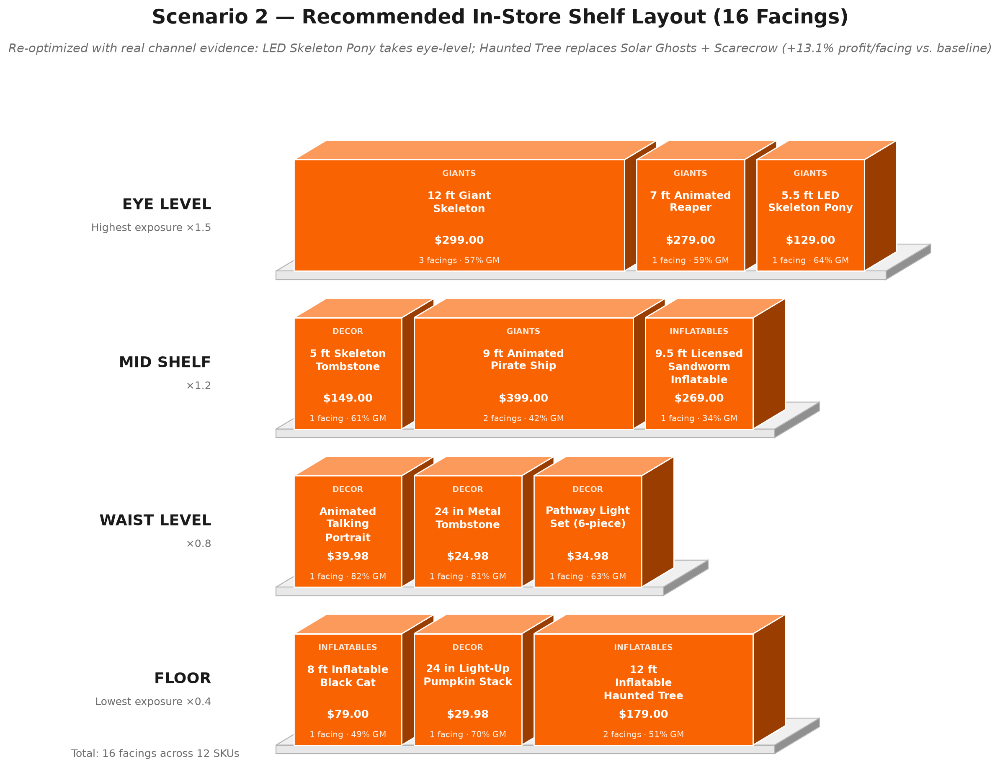

# Halloween Decor Assortment — Simulation Report

**Prepared for:** VP Merchandising review
**Model:** Python Monte Carlo simulation, 10,000 customer visits per configuration
**Source data:** `Halloween_Line Review Case Study_Data - Copy.xlsx` (actual last-season performance + supplier offer sheet; withheld from the repository — see README), cross-checked against the team's `Halloween Assortment — Team Calculator & Scenario Comparison.xlsx`
**Code:** [`halloween_simulation.py`](halloween_simulation.py), [`halloween_shelf_layout.py`](halloween_shelf_layout.py), [`halloween_shelf_layout_3d.py`](halloween_shelf_layout_3d.py)

---

## 1. Recommendation

Adopt **Scenario 2** as the in-store assortment (16 facings, 12 SKUs) plus 4 online-only items. Relative to the current assortment:

| Metric | Current (Baseline) | Scenario 2 (Recommended) | Change |
|---|---:|---:|---:|
| Profit per Facing | $61,233 | **$69,246** | **+13.1%** |
| Conversion Rate | 64.4% | 66.4% | +2.0 pts |
| Avg. Items / Customer | 1.118 | 1.191 | +6.5% |
| In-Store Total Profit (GM $) | $979,735 | $1,107,942 | +13.1% |
| Combined Profit (in-store + online) | $1,376,962 | $1,495,677 | +8.6% |

This is the model's final, settled recommendation — it supersedes two earlier drafts (see Section 6 for the full history: the original swap, then an eye-level correction, then this version after adding real channel evidence).

---

## 2. Full Placement Map — Every Item, Where It Goes

This is the complete answer to "where is each product placed": all 26 items considered anywhere in this analysis (12 current in-store, 4 current online-only, 10 new supplier candidates), one list.

| Item | Channel | Facings | Shelf Position |
|---|---|---:|---|
| 12 ft Giant Skeleton | **In-Store** | 3 | Eye |
| 7 ft Animated Reaper | **In-Store** | 1 | Eye |
| 5.5 ft LED Skeleton Pony | **In-Store** | 1 | Eye |
| 5 ft Skeleton Tombstone | **In-Store** | 1 | Mid |
| 9 ft Animated Pirate Ship | **In-Store** | 2 | Mid |
| 9.5 ft Licensed Sandworm Inflatable | **In-Store** | 1 | Mid |
| Animated Talking Portrait | **In-Store** | 1 | Waist |
| 24 in Metal Tombstone | **In-Store** | 1 | Waist |
| Pathway Light Set (6-piece) | **In-Store** | 1 | Waist |
| 8 ft Inflatable Black Cat | **In-Store** | 1 | Floor |
| 24 in Light-Up Pumpkin Stack | **In-Store** | 1 | Floor |
| 12 ft Inflatable Haunted Tree | **In-Store** | 2 | Floor |
| Life-Size Animated Butler | **Online-Only** | — | — |
| 16 ft Inflatable Haunted Archway | **Online-Only** | — | — |
| Animated Witch Cauldron | **Online-Only** | — | — |
| 10.5 ft Licensed Character Inflatable | **Online-Only** | — | — |
| LED Fog Machine | *Removed* — weak economics | — | — |
| 12 ft Reaper Inflatable | *Removed* — weak economics | — | — |
| Halloween Doormat Assortment | *Removed* — weak economics | — | — |
| 6 ft Scarecrow Inflatable | *Displaced* — edged out by Haunted Tree | — | — |
| Solar Pathway Ghosts (4-pc) | *Displaced* — edged out by Haunted Tree | — | — |
| 14 ft Giant Animated Dragon | *Not selected* — too large a bet | — | — |
| 6 ft Licensed Movie Villain | *Not selected* — weaker than Sitcom alternative | — | — |
| 9 ft Licensed Franchise Inflatable | *Not selected* — worst margin in offer sheet | — | — |
| 7 ft Licensed Sitcom Character | *Not selected* — loses to existing Reaper | — | — |
| Fog Machine w/ Bluetooth Sound | *Not selected* — same failure risk as current fog | — | — |

**In-store total: 16 facings / 12 SKUs. Online total: 4 SKUs.** Both within the case study's limits (exactly 16 facings; up to 4 online items).

Visual layout: see Section 6 and the graphics below.

---

## 3. Assortment Breakdown, With Rationale

All GM $ figures are the simulator's actual output for that SKU over the 10,000-customer run (`halloween_simulation_item_detail.csv`), under Scenario 2's real position, facings, category multiplier, and channel-affinity multiplier (Section 7).

### In-Store (12 SKUs, 16 facings)

| Item | Facings | Position | Sim. GM $ / 10K visits | GM $ / Facing | Why |
|---|---:|---|---:|---:|---|
| 12 ft Giant Skeleton | 3 | Eye | $335,294 | $111,765 | Largest profit contributor by a wide margin — proven 95% sell-through hero |
| 7 ft Animated Reaper | 1 | Eye | $241,557 | $241,557 | Highest GM-per-facing of any item simulated |
| 5.5 ft LED Skeleton Pony | 1 | Eye | $133,956 | $133,956 | Takes the 3rd eye slot: real historical data shows 55% of its units sold in-store (vs. 45% for the item it displaced here) — channel evidence, not just economics, favors it at eye level |
| 5 ft Skeleton Tombstone | 1 | Mid | $102,625 | $102,625 | Still highly profitable at mid-shelf; its real 45%/55% online-leaning split is the reason it lost the eye-level slot to the Pony |
| 9 ft Animated Pirate Ship | 2 | Mid | $99,203 | $49,602 | Lower sell-through (60%) than other heroes, but high price keeps GM/facing solid |
| 9.5 ft Licensed Sandworm Inflatable | 1 | Mid | $64,403 | $64,403 | Royalty drag offset by strong 80% historical sell-through |
| Animated Talking Portrait | 1 | Waist | $31,067 | $31,067 | New item; highest margin *rate* in the file (82.5%), but its $39.98 price caps dollar contribution — profitable, just not eye-level material |
| 24 in Metal Tombstone | 1 | Waist | $24,897 | $24,897 | Near-zero unit cost (81.1% margin) keeps it profitable at any position |
| Pathway Light Set (6-piece) | 1 | Waist | $25,968 | $25,968 | Consistent performer, 70% historical store share |
| 8 ft Inflatable Black Cat | 1 | Floor | $12,909 | $12,909 | New item; no-royalty inflatable, 49.4% margin |
| 24 in Light-Up Pumpkin Stack | 1 | Floor | $9,126 | $9,126 | New item; cheap impulse buy, comparable to other floor items |
| 12 ft Inflatable Haunted Tree | 2 | Floor | $26,936 | $13,468 | New item; swapped in for Solar Ghosts + Scarecrow (net +3.15%) — see Section 6. **Caveat:** the vendor sheet's own merchant note flags this item's large footprint as possibly better suited to online fulfillment; the simulation doesn't model shipping/footprint cost, only sales economics |

### Online-Only (4 SKUs)

| Item | Why |
|---|---|
| Life-Size Animated Butler | 90% historical sell-through, 60.4% margin rate — best-performing item in the file, any channel |
| 16 ft Inflatable Haunted Archway | 85% sell-through, 48.4% margin — large footprint suits online fulfillment |
| Animated Witch Cauldron | 85% sell-through, 58.9% margin — solid, no reason to disturb |
| 10.5 ft Licensed Character Inflatable | **Moved from in-store.** Only 4.2% margin rate in the physical aisle (worst GM/facing among items with real demand); real channel split (40%/60%) supports the move — frees 2 facings without dropping the SKU |

### Removed — Weak Economics (3 SKUs)

| Item | Why |
|---|---|
| LED Fog Machine | 32% sell-through, 5.0% margin — simulated at just $497–$608 GM per 10,000 visits historically |
| 12 ft Reaper Inflatable | 50% sell-through, 2.5% margin — simulated at just $612–$672 GM per 10,000 visits |
| Halloween Doormat Assortment | 45% sell-through even online, 17.2% margin — weakest item in the file |

### Displaced by the Haunted Tree Swap (2 SKUs)

| Item | Why |
|---|---|
| 6 ft Scarecrow Inflatable | Not a poor performer (85% sell-through, 35.9% margin) — simply edged out when the Haunted Tree's 2-facing combined value beat this item + Solar Ghosts occupying the same 2 facings |
| Solar Pathway Ghosts (4-pc) | Same story — solid new item, edged out by a better use of its 1 facing once the Tree swap was tested |

### New Candidates Not Selected (5 SKUs)

| Item | Why |
|---|---|
| 14 ft Giant Animated Dragon | Ranks well economically (#3 eye-level candidate) but needs 4 facings (25% of the whole assortment) for a zero-track-record item — the merchant's own note warns "no brand equity... every clearance unit loses money" |
| 7 ft Licensed Sitcom Character | Would compete directly with the 7 ft Animated Reaper for the same eye-level Giants slot — the Reaper beats it 2x on profit/facing |
| 6 ft Licensed Movie Villain | Same niche as the Sitcom Character, weaker margin (34.7% vs. 41.2%) from heavier royalty |
| Fog Machine w/ Bluetooth Sound | Same category as the fog machine we're removing for poor performance; nothing in the data supports assuming Bluetooth fixes last season's problem |
| 9 ft Licensed Franchise Inflatable | Worst margin in the entire offer sheet (13.2%) — royalty leaves almost nothing |

---

## 4. Methodology

Three 16-facing shelf configurations were simulated, each run against 10,000 independent customer visits:

- **Config A — Current (Baseline):** last season's actual 16-facing assortment and shelf positions.
- **Config B — High-Margin Focus:** an alternative that pushes the four highest-margin-*rate* new items to eye level and drops the licensed inflatable entirely.
- **Config C — Scenario 2 (Recommended):** the final, re-optimized layout (Section 6).

**Per-customer purchase model:**

```
P(purchase item i) = base_prob(i) × position_mult × customer_type_mult × category_mult
                      × facings_mult × channel_mult × attention_factor
```

- `base_prob(i)` — anchored to the item's real full-price sell-through (assumed for the new items, based on vendor pitch and merchant notes), scaled to a plausible 2%–15% per-visit range. Also scaled by a `demand_mult` for the stress test (Section 9).
- `position_mult` — eye 1.5× / mid 1.2× / waist 0.8× / floor 0.4×.
- `customer_type_mult` — 30% of customers are impulse buyers (1.3×), 70% are goal-oriented (0.6×).
- `category_mult` — hero (Giants & Animatronics) 1.0×, inflatable 0.95×, licensed 0.85× (royalty drag), high-margin decor 1.2×, other decor/impulse accessory 1.1×.
- `facings_mult` — each additional facing beyond the first adds visibility (+15% per extra facing).
- `channel_mult` — **new in this version.** Real last-season Store Units / Online Units split, applied only to current items sold through both channels (Section 7).
- `attention_factor` — LogNormal(mean=90s, sd=45s) browse-time draw per customer; longer browsing scales purchase likelihood up (clipped 0.6×–1.6×).

Random seed fixed at 42 for reproducibility — results are deterministic across reruns.

**Caveat for Q&A:** the position/customer/category multipliers are specified inputs; the base-probability scaling constant and facings multiplier are modeling assumptions chosen to keep results in a believable range, not measured figures. The channel multiplier is the one component now grounded in real historical data rather than assumption. Numbers should be read as directionally reliable, not decimal-precise forecasts.

---

## 5. Full Results

| | A – Current | B – High-Margin Focus | C – Scenario 2 |
|---|---:|---:|---:|
| Avg. Revenue / Customer | $201.12 | $149.57 | $200.66 |
| Avg. GM / Customer | $97.97 | $83.61 | $110.79 |
| Avg. Items / Customer | 1.118 | 1.189 | 1.191 |
| Conversion Rate | 64.4% | 66.5% | 66.4% |
| In-Store Total Revenue | $2,011,213 | $1,495,733 | $2,006,613 |
| In-Store Total Profit (GM $) | $979,735 | $836,107 | $1,107,942 |
| **Profit per Facing** | **$61,233** | **$52,257** | **$69,246** |
| Online Total Profit (GM $) | $397,227 | $425,865 | $387,735 |
| Combined Total Profit | $1,376,962 | $1,261,971 | $1,495,677 |
| % vs. Baseline (Profit/Facing) | — | −14.7% | **+13.1%** |

Config B still underperforms the baseline: pulling two current volume drivers (Fog Machine, Licensed Character) for smaller-ticket new decor items raises conversion slightly but lowers average basket revenue enough to cost profit overall.

Full per-item detail: [`halloween_simulation_item_detail.csv`](halloween_simulation_item_detail.csv)

---

## 6. Shelf-Position Optimization — Full History

This recommendation went through three iterations. Documenting all three because the reasoning at each step is itself useful for Q&A.

**Iteration 1 — original Scenario 2:** eye level = 12 ft Giant Skeleton, 7 ft Animated Reaper, Animated Talking Portrait (the case study's own proposal).

**Iteration 2 — eye-level correction:** an exact optimizer (dynamic program over the fixed 13-item roster) found the Talking Portrait ($39.98, 82.5% margin *rate*) generates less absolute profit per facing at eye level than the 5 ft Skeleton Tombstone ($149, 61.2% margin) — margin rate overstated its shelf-space value relative to margin *dollars*. Swap lifted profit/facing +12.2%.

**Iteration 3 — this version, after adding real channel evidence (Section 7) and testing an unused supplier candidate:**
1. **Eye-level swap #2:** with real Store/Online unit splits now in the model, the 5.5 ft LED Skeleton Pony (55% store-favoring) beats the Skeleton Tombstone (55% online-favoring) for the 3rd eye slot. The Tombstone moves to mid, still profitable.
2. **Composition swap:** the 12 ft Inflatable Haunted Tree ranked #12 of 26 products by profit/facing potential — ahead of 3 of the 4 new items actually in Scenario 2 — yet wasn't in any config. Testing it (swapped in for Solar Pathway Ghosts + 6 ft Scarecrow Inflatable, freeing the 2 facings it needs) and re-running the full optimizer produced a further **+3.15%**.

Combined, iterations 2+3 take Scenario 2 from $61,233/facing (baseline-equivalent layout) to $69,246/facing — a cumulative **+13.1%**.

**One open caveat:** the team's own scenario-comparison workbook places the Haunted Tree **online**, not in-store, citing the vendor's note that its "large footprint supports online placement" and that the compact-carton claim is unverified. This simulation only models sales economics, not shipping/fulfillment cost or floor footprint — so the Tree's in-store recommendation here should be weighed against that physical/logistics consideration before finalizing.

### Recommended Shelf Layout




---

## 7. Channel Evidence: Real Store/Online Unit Split

The workbook (and the team's own Channel Evidence sheet) supplies actual last-season **Store Units** and **Online Units** for every current item. This is now used as a real, evidence-based **channel-affinity multiplier**: an item that historically sold mostly online converts a bit worse when modeled in-store, and vice versa. Items that were 100%-exclusive to one channel last season (the 4 already-online items) get no adjustment — a 0%/100% split for them reflects that they were never offered in-store, not a revealed preference. New items also get no adjustment (no history).

`channel_mult = (channel's real unit share) / 0.5` — so a 50/50 split is neutral (1.0×).

| Item | Store Units | Online Units | Store Share | Online Share | In-Store Mult | Online Mult |
|---|---:|---:|---:|---:|---:|---:|
| 12 ft Giant Skeleton | 18,000 | 22,000 | 45% | 55% | 0.90x | 1.10x |
| 9 ft Animated Pirate Ship | 2,700 | 6,300 | 30% | 70% | 0.60x | 1.40x |
| 7 ft Animated Reaper | 6,000 | 6,000 | 50% | 50% | 1.00x | 1.00x |
| 5.5 ft LED Skeleton Pony | 7,700 | 6,300 | 55% | 45% | 1.10x | 0.90x |
| 10.5 ft Licensed Character Inflatable | 3,200 | 4,800 | 40% | 60% | 0.80x | 1.20x |
| 9.5 ft Licensed Sandworm Inflatable | 1,750 | 3,250 | 35% | 65% | 0.70x | 1.30x |
| 12 ft Reaper Inflatable | 2,700 | 3,300 | 45% | 55% | 0.90x | 1.10x |
| 6 ft Scarecrow Inflatable | 13,000 | 7,000 | 65% | 35% | 1.30x | 0.70x |
| 24 in Metal Tombstone | 21,000 | 9,000 | 70% | 30% | 1.40x | 0.60x |
| 5 ft Skeleton Tombstone | 3,150 | 3,850 | 45% | 55% | 0.90x | 1.10x |
| LED Fog Machine | 15,000 | 10,000 | 60% | 40% | 1.20x | 0.80x |
| Pathway Light Set (6-piece) | 12,600 | 5,400 | 70% | 30% | 1.40x | 0.60x |
| 16 ft Archway / Butler / Cauldron / Doormat | 0 | all | 0% | 100% | 1.00x (n/a — availability artifact, not preference) | 1.00x |
| All 10 new candidates | — | — | — | — | 1.00x (no history) | 1.00x (no history) |

**Effect on results:** applying this multiplier dropped every config's absolute profit/facing (most in-store items skew somewhat online historically), but Scenario 2's *lead over baseline* held essentially steady (was +12.2%, now +13.1% after also re-optimizing positions against the new evidence).

Full detail (all 26 items, including margins, ratings, and category multiplier labels): [`halloween_simulation_full_product_data.csv`](halloween_simulation_full_product_data.csv)

---

## 8. Sensitivity: Impulse Buyer Share

The 30% impulse-buyer assumption was stress-tested from 10% to 70% impulse share, holding everything else fixed.

| Impulse Share | A – Current | B – High-Margin | C – Scenario 2 |
|---:|---:|---:|---:|
| 10% | $50,865 | $43,244 | $57,442 |
| 20% | $56,200 | $47,724 | $63,570 |
| 30% (base case) | $61,233 | $52,257 | **$69,246** |
| 40% | $66,102 | $56,737 | $75,424 |
| 50% | $70,921 | $61,135 | $81,550 |
| 60% | $76,226 | $65,598 | $87,666 |
| 70% | $81,625 | $70,031 | $93,374 |

*(Profit per facing, $)*

Scenario 2 leads at **every** impulse-share level tested. Not dependent on hitting the 30% assumption exactly.

Full sweep: [`halloween_simulation_sensitivity.csv`](halloween_simulation_sensitivity.csv)

---

## 9. Sensitivity Check: Customer Star Ratings

**Question:** should the workbook's Star Rating / # Reviews columns feed the purchase model?

**Why they're left out of the base model:** star rating and full-price sell-through only correlate at r ≈ 0.45 across the 16 rated items (0.34 excluding the LED Fog Machine outlier). The 12 ft Reaper Inflatable carries a 4.8-star rating despite being one of the worst sellers (50% sell-through); the Fog Machine has the most reviews in the file (3,400) yet only 32% sell-through. The two highest-rated items (Metal Tombstone 5.0★, Skeleton Tombstone 4.8★) have just 6 and 10 reviews — too small a sample to trust. Sell-through is a direct, revealed measure of what customers bought; ratings are noisy at this sample size.

**Tested anyway:** `rating_mult = star_rating / 4.5` (new items get 1.0x, no adjustment).

| Config | Metric | Baseline (no ratings) | With Star Ratings | Change |
|---|---|---:|---:|---:|
| A – Current | Profit per Facing | $61,233 | $61,492 | +0.42% |
| A – Current | Conversion Rate | 64.4% | 65.2% | +1.20% |
| A – Current | Combined Profit | $1,376,962 | $1,393,908 | +1.23% |
| B – High-Margin | Profit per Facing | $52,257 | $52,116 | −0.27% |
| B – High-Margin | Conversion Rate | 66.5% | 66.7% | +0.38% |
| B – High-Margin | Combined Profit | $1,261,971 | $1,272,201 | +0.81% |
| C – Scenario 2 | Profit per Facing | $69,246 | $69,347 | +0.14% |
| C – Scenario 2 | Conversion Rate | 66.4% | 66.8% | +0.59% |
| C – Scenario 2 | Combined Profit | $1,495,677 | $1,510,871 | +1.02% |

**Result:** largest change across every metric and all 3 configs is **+1.23%**. Ratings tested and confirmed immaterial to the recommendation.

Full detail: [`halloween_simulation_rating_check.csv`](halloween_simulation_rating_check.csv)

---

## 10. Stress Test: Base / Downside / Upside Demand Cases

Mirrors the team's own Assumptions-sheet demand cases: **Downside** = 70% of base full-price demand (a soft season or a merchandising miss); **Upside** = 115% of base. Applied uniformly to every item; positions, facings, and channel mix held fixed.

| Demand Case | A – Current | B – High-Margin | C – Scenario 2 |
|---|---:|---:|---:|
| Downside | $43,001 | $36,537 | **$48,564** |
| Base | $61,233 | $52,257 | **$69,246** |
| Upside | $67,950 | $58,368 | **$77,246** |

Scenario 2 leads in every case, including the stress case.

**Per-item fragility (Scenario 2, Base → Downside, most fragile first):**

| Item | Base GM $ | Downside GM $ | Change |
|---|---:|---:|---:|
| 8 ft Inflatable Black Cat | $12,909 | $8,775 | −32.0% |
| 5 ft Skeleton Tombstone | $102,625 | $70,424 | −31.4% |
| 9.5 ft Licensed Sandworm Inflatable | $64,403 | $44,334 | −31.2% |
| 24 in Light-Up Pumpkin Stack | $9,126 | $6,315 | −30.8% |
| Pathway Light Set (6-piece) | $25,968 | $17,980 | −30.8% |
| 5.5 ft LED Skeleton Pony | $133,956 | $92,954 | −30.6% |
| 7 ft Animated Reaper | $241,557 | $168,387 | −30.3% |
| 12 ft Inflatable Haunted Tree | $26,936 | $18,837 | −30.1% |
| Animated Talking Portrait | $31,067 | $21,767 | −29.9% |
| 24 in Metal Tombstone | $24,897 | $17,584 | −29.4% |
| 12 ft Giant Skeleton | $335,294 | $237,677 | −29.1% |
| 9 ft Animated Pirate Ship | $99,203 | $71,994 | −27.4% |

Impact is fairly uniform (−27.4% to −32.0%) — nothing in the assortment is disproportionately fragile to a soft season.

Full detail: [`halloween_simulation_stress_test.csv`](halloween_simulation_stress_test.csv), [`halloween_simulation_stress_test_by_item.csv`](halloween_simulation_stress_test_by_item.csv)

---

## 11. Files

| File | Contents |
|---|---|
| `halloween_simulation.py` | Full simulation, sensitivity, optimizer, channel-evidence, and stress-test source |
| `halloween_shelf_layout.py` / `.png` | 2D planogram graphic |
| `halloween_shelf_layout_3d.py` / `.png` | Static 3D render of the same layout |
| `halloween_simulation_results.csv` | 3-config comparison table (Section 5) |
| `halloween_simulation_item_detail.csv` | Per-item simulated units/revenue/GM, all 3 configs |
| `halloween_simulation_sensitivity.csv` | Impulse-share sweep, long format |
| `halloween_simulation_eye_level_ranking.csv` | All 26 products ranked by expected profit/facing at eye level |
| `halloween_simulation_rating_check.csv` | Star-rating sensitivity check, all 3 configs |
| `halloween_simulation_stress_test.csv` | Base/Downside/Upside by config |
| `halloween_simulation_stress_test_by_item.csv` | Base/Downside per Scenario 2 item |
| `halloween_simulation_full_product_data.csv` | All 26 items: economics, ratings, channel evidence, multipliers |
| `halloween_gm_profit_summary.md` | Per-item GM/profit for in-store, online, and removed items |
| `halloween_shelf_layout_requested_items.png` | 2D layout of an alternate 13-item roster (not the official recommendation) |
